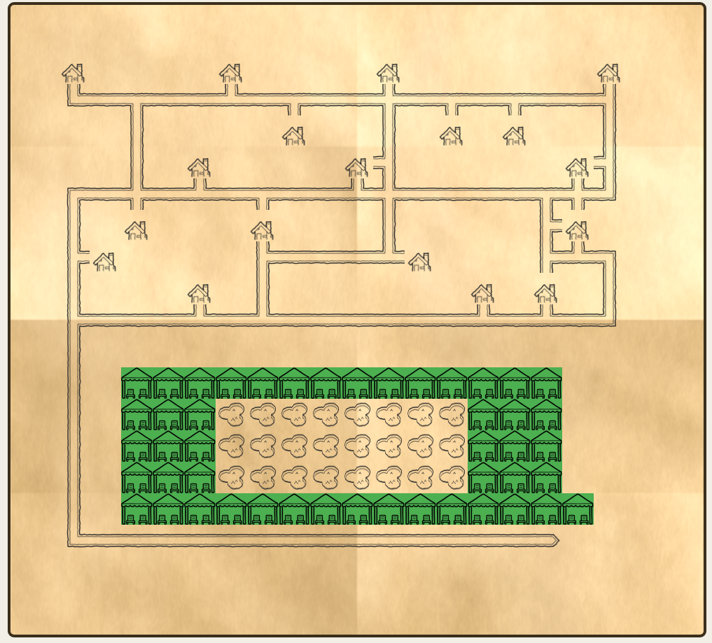

🏝️ Resort Map — Interactive Cabana Booking Webapp
This project implements a full-stack web application for browsing a resort map and booking poolside cabanas.
It consists of:

- Backend (Node.js + Express) — provides a RESTful API for map data, cabana availability, validation, and booking.
- Frontend (Next.js) — displays an interactive resort map, allows guests to click cabanas, validate their stay, and complete a booking.
  The application uses ASCII map files and JSON booking data provided at startup.
  All cabana booking state is stored in memory (no persistent storage required).

🚀 Quick Start

1. Install dependencies

   Run from project root/apps/fronend:

   npm install

   Run from project root/apps/backend:

   npm install

2. Start the full application (backend + frontend) from project root:

   npm run dev

This uses default files:

- map.ascii
- bookings.json

3. Start with a custom map

   npm run dev customMap.ascii

4. Start with custom map + custom bookings

   npm run dev customMap.ascii customBookings.json

5. Start with custom bookings only

   npm run dev "" customBookings.json

🗺️ Map Format
The resort map is provided as an ASCII file.
Each character represents a tile:

| Symbol | Meaning     | Description                                                        |
| ------ | ----------- | ------------------------------------------------------------------ |
| `W`    | Cabana      | Bookable cabana. Clickable. Shows availability and allows booking. |
| `p`    | Pool        | Pool area. Decorative tile, not interactive.                       |
| `#`    | Path        | Walkway/path tile. Used for navigation layout.                     |
| `c`    | Chalet      | Guest chalet/building. Decorative tile, not interactive.           |
| `.`    | Empty space | Grass/ground/empty area. Used for spacing and layout.              |

Example:
....pppp....

..W..##..W..

....##......

The backend converts this into a grid and exposes it via the API.

🔌 API Overview
GET /api/map
Returns the resort map and cabana availability.
POST /api/validate
Validates room number + guest name against the bookings file.
Request:
{ "room": "204", "name": "John Doe" }

POST /api/cabanas/book
Books a cabana if available and guest is valid.
Request:
{ "cabanaId": "W1", "room": "204", "name": "John Doe" }

Responses:

- 200 OK — booking confirmed
- 400 Bad Request — invalid guest
- 409 Conflict — cabana already booked

🖥️ Frontend Features

- Renders the ASCII map using graphical tiles from /assets
- Clickable cabanas (W)
- Modal booking flow:
- enter room number
- enter guest name
- validate via API
- confirm booking
- Immediate map refresh after booking
- Booked cabanas shown with a distinct visual style

🧪 Automated Tests
Backend tests cover:

- Map loading
- Booking validation
- Booking conflicts
- REST API responses
  Frontend tests cover:
- Map rendering
- Cabana click interaction
- Modal behavior
- Booking flow
- Error messages
  Run all tests:
  npm test

📸 Screenshot

🧠 Design Decisions & Trade-offs

- Argument handling:
  I chose simple positional CLI arguments (npm run dev map bookings) because they work reliably across Windows, macOS, and Linux without issues with PowerShell swallowing flags.
- In-memory booking state:
  The task does not require persistence, so cabana availability is stored in memory. This keeps the backend simple and fast.
- ASCII map → tile grid:
  Using the ASCII map as the single source of truth ensures the frontend always reflects the backend state without duplication.
- REST-first architecture:
  The frontend never reads files directly — all data flows through the API, matching the assignment requirements.
- Minimal UI complexity:
  The interface focuses on clarity and correctness rather than visual polish, prioritizing functionality and readability.

🤖 LLM Usage
This project was developed with assistance from an LLM to accelerate:

- CLI argument handling
- Backend routing structure
- Debugging Windows-specific npm behavior
  Prompts included:
- “Help me design a backend API for cabana booking”
- “Fix Windows npm argument parsing”

📂 Project Structure
ResortMapCode/
run-dev.js
package.json
apps/
backend/
index.js
map/
bookings/
routes/
frontend/
pages/
components/
public/assets/

🏁 Summary
This project delivers a complete, interactive cabana booking experience with:

- a clean REST API,
- a responsive map UI,
- real-time booking updates,
- simple startup command,

  You're ready to run, test, and review the entire solution with a single command:
  npm run dev
